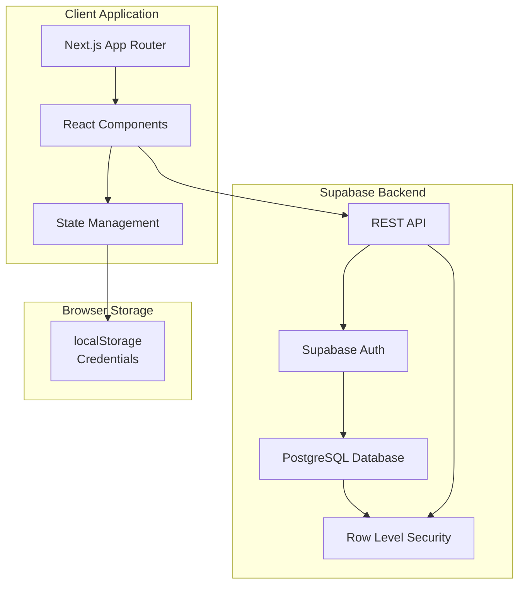
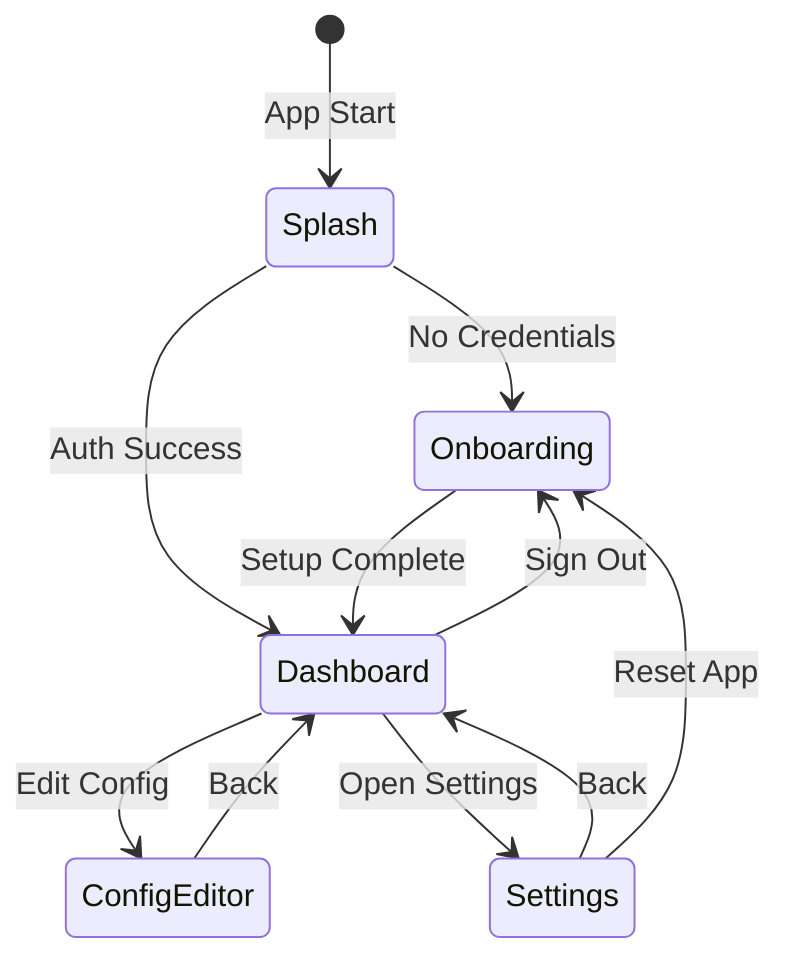
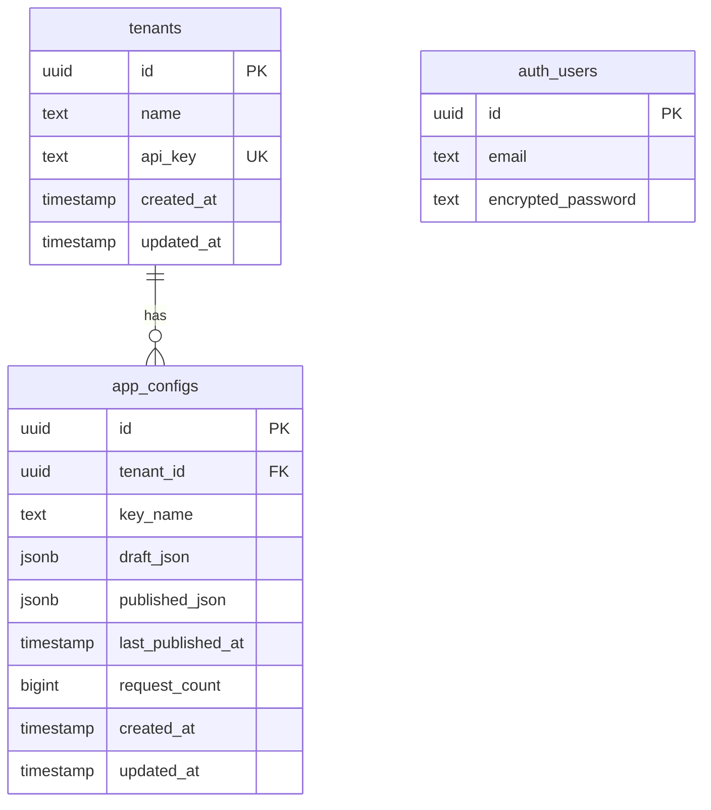
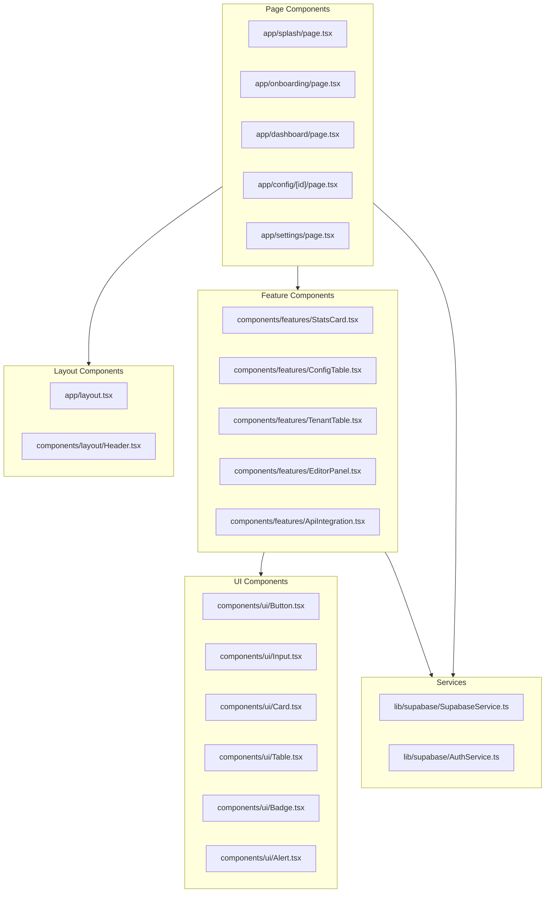
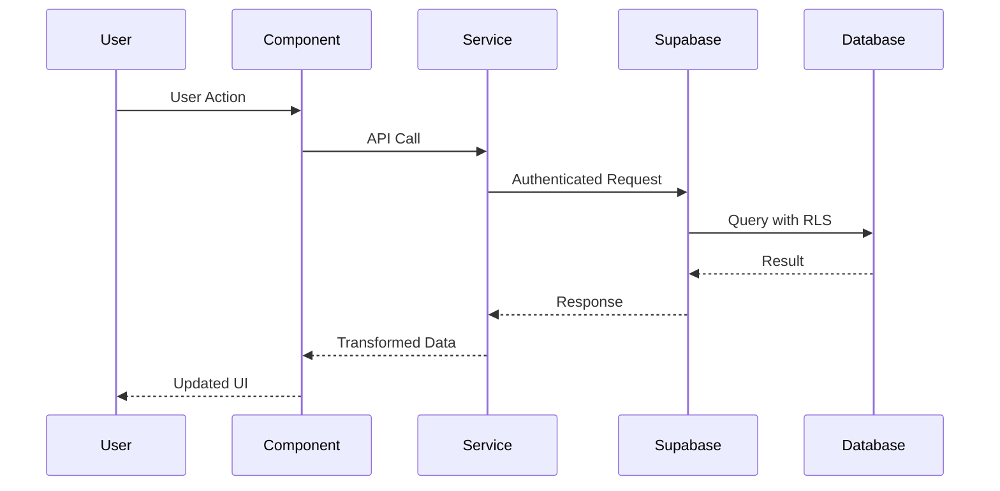
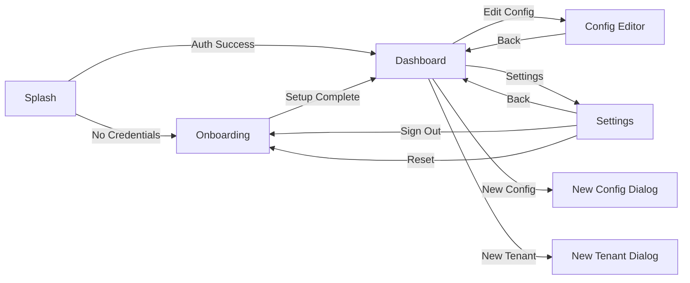

# MasterFabric Remote - Complete Implementation Plan

## Overview

Build a multi-tenant Remote Config Manager using Next.js 16, Supabase, TypeScript, and Tailwind CSS with a white hierarchy design system. The application manages remote configurations with draft/published workflows, tenant isolation, and API access.

## Architecture Overview



## Application Flow



## Database Schema



## Component Architecture



## Data Flow



## Implementation Phases

### Phase 1: Project Setup & Core Infrastructure

**Files to Create:**

- `lib/supabase/client.ts` - Supabase client initialization
- `lib/supabase/SupabaseService.ts` - Centralized service layer
- `lib/supabase/AuthService.ts` - Authentication service
- `lib/utils/storage.ts` - localStorage utilities
- `types/index.ts` - TypeScript type definitions
- `app/globals.css` - Tailwind configuration with white hierarchy

**Dependencies to Install:**

- `@supabase/supabase-js` - Supabase client
- `lucide-react` - Icon library
- `zustand` (optional) - State management

### Phase 2: UI Component Library

**Files to Create:**

- `components/ui/Button.tsx` - Primary, Secondary, Ghost, Danger variants
- `components/ui/Input.tsx` - Text and Password inputs
- `components/ui/Card.tsx` - Card container with header/content
- `components/ui/Table.tsx` - Table components
- `components/ui/Badge.tsx` - Status badges
- `components/ui/Alert.tsx` - Success/Error/Warning alerts
- `components/ui/CodeBlock.tsx` - Code display with copy
- `components/ui/Spinner.tsx` - Loading indicators

**Design System:**

- Pure white backgrounds (`bg-white`)
- High contrast text (`text-gray-900`)
- Soft borders (`border-gray-200`)
- Minimal shadows (`shadow-sm`)
- Lucide icons only

### Phase 3: Splash View

**Files to Create:**

- `app/splash/page.tsx` - Connection check screen
- `app/splash/loading.tsx` - Loading state

**Logic:**

1. Check localStorage for `supabase_url` and `supabase_anon_key`
2. If missing → redirect to `/onboarding`
3. If present → initialize Supabase client
4. Attempt authentication with default credentials
5. On success → redirect to `/dashboard`
6. On failure → clear storage → redirect to `/onboarding`

### Phase 4: Onboarding View

**Files to Create:**

- `app/onboarding/page.tsx` - Setup screen
- `components/features/SqlScriptCard.tsx` - SQL script display

**Features:**

- Supabase URL input
- Anon Key input (password field with toggle)
- SQL script display with copy button
- Live connection test
- Error handling and validation
- Success → save credentials → redirect to dashboard

### Phase 5: Dashboard View

**Files to Create:**

- `app/dashboard/page.tsx` - Main dashboard
- `components/layout/Header.tsx` - App header with navigation
- `components/features/StatsCard.tsx` - Statistics cards
- `components/features/ConfigTable.tsx` - Configurations table
- `components/features/TenantTable.tsx` - Tenants table
- `components/features/NewConfigDialog.tsx` - Create config modal
- `components/features/NewTenantDialog.tsx` - Create tenant modal

**Data Fetching:**

- Fetch all tenants
- Fetch all configs with tenant relationships
- Calculate statistics (total configs, requests, active tenants)
- Display in tables with actions

### Phase 6: Config Editor View

**Files to Create:**

- `app/config/[id]/page.tsx` - Config detail page
- `components/features/EditorPanel.tsx` - Draft/Published editor
- `components/features/ApiIntegration.tsx` - API documentation card
- `lib/utils/json.ts` - JSON validation utilities

**Features:**

- Side-by-side draft/published panels
- JSON editor with syntax validation
- Save draft functionality
- Publish functionality (draft → published)
- API endpoint display
- cURL example with copy
- Request statistics

### Phase 7: Settings View

**Files to Create:**

- `app/settings/page.tsx` - Settings screen
- `components/features/ConnectionSettings.tsx` - Connection card
- `components/features/SessionCard.tsx` - Session info
- `components/features/DangerZone.tsx` - Reset functionality

**Features:**

- Edit Supabase credentials
- Test connection
- Save changes
- Sign out
- Reset application (clear all data)

### Phase 8: Routing & Navigation

**Files to Update:**

- `app/layout.tsx` - Root layout with metadata
- `app/page.tsx` - Root redirect to splash
- `middleware.ts` - Route protection (optional)

**Routes:**

- `/` → redirect to `/splash`
- `/splash` → connection check
- `/onboarding` → setup
- `/dashboard` → main hub
- `/config/[id]` → config editor
- `/settings` → settings

## Key Implementation Details

### Supabase Service Pattern

```typescript
// lib/supabase/SupabaseService.ts
class SupabaseService {
  private client: SupabaseClient;
  
  async getTenants(): Promise<Tenant[]>
  async createTenant(data: CreateTenantInput): Promise<Tenant>
  async getConfigs(): Promise<AppConfig[]>
  async updateConfig(id: string, data: UpdateConfigInput): Promise<AppConfig>
  async publishConfig(id: string): Promise<void>
}
```

### State Management

- Use React Context for auth state
- Use local component state for forms
- Use server components for data fetching (Next.js App Router)
- Optional: Zustand for global UI state

### Error Handling

- Toast notifications for user feedback
- Error boundaries for component errors
- Graceful fallbacks for API failures
- Validation at input and service layers

### Type Safety

```typescript
// types/index.ts
interface Tenant {
  id: string;
  name: string;
  api_key: string;
  created_at: string;
  updated_at: string;
}

interface AppConfig {
  id: string;
  tenant_id: string;
  key_name: string;
  draft_json: Record<string, any>;
  published_json: Record<string, any>;
  last_published_at: string | null;
  request_count: number;
  created_at: string;
  updated_at: string;
}
```

## UI Flow Diagram



## Testing Strategy

1. **Unit Tests**: Component logic, utilities, services
2. **Integration Tests**: API interactions, auth flows
3. **E2E Tests**: Critical user journeys (onboarding → dashboard → edit → publish)
4. **Manual Testing**: UI/UX validation, design system compliance

## Deployment Considerations

1. **Environment Variables**: Supabase URL/keys (client-side safe)
2. **Build Optimization**: Next.js production build
3. **Static Assets**: Favicon, logos
4. **Database Setup**: SQL script execution in Supabase dashboard
5. **RLS Policies**: Verify all policies are active

## Design System Compliance

- Pure white backgrounds (`bg-white`) - no gray backgrounds
- No shadows in light mode (per user preference)
- High contrast text (`text-gray-900`)
- Soft borders (`border-gray-200`)
- Rounded corners (`rounded-lg`, `rounded-xl`)
- Lucide icons only (no emojis)
- Minimal accent colors for status indicators

## Next Steps After Implementation

1. Add request count tracking (API endpoint)
2. Add config version history
3. Add export/import functionality
4. Add search and filtering
5. Add bulk operations
6. Add