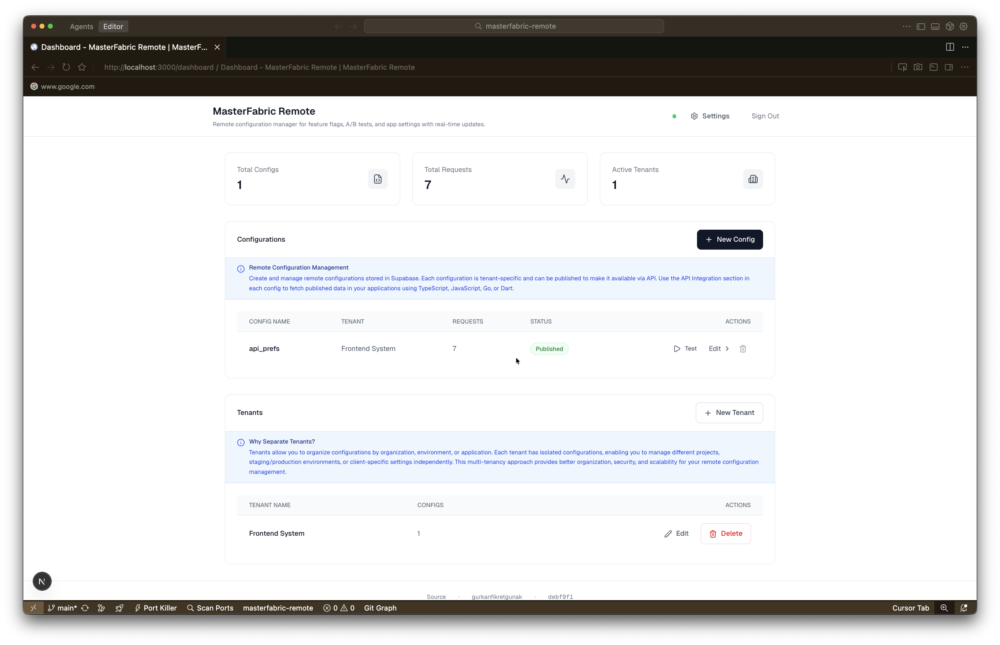
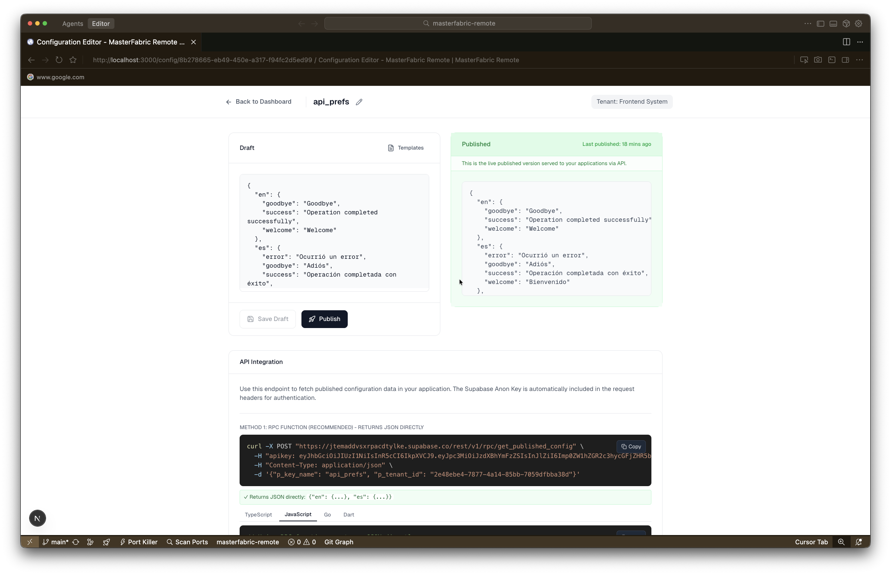
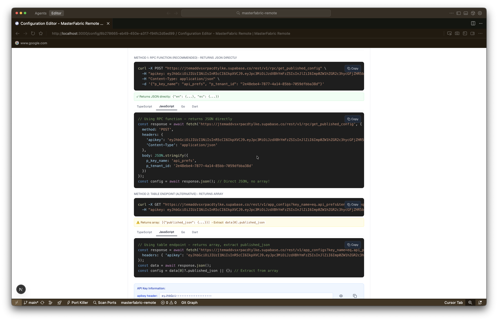
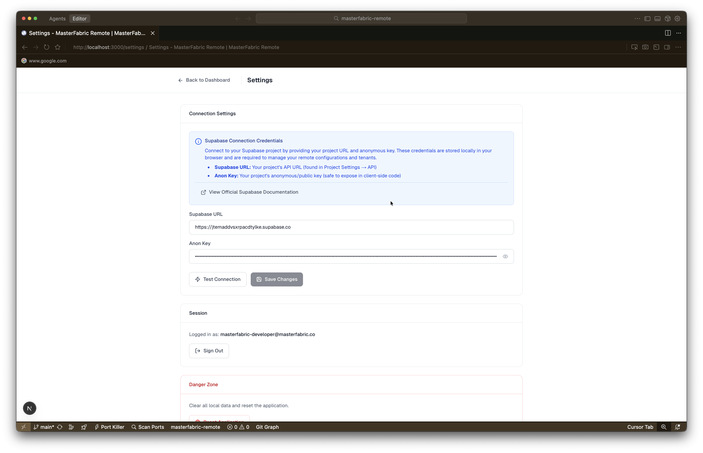
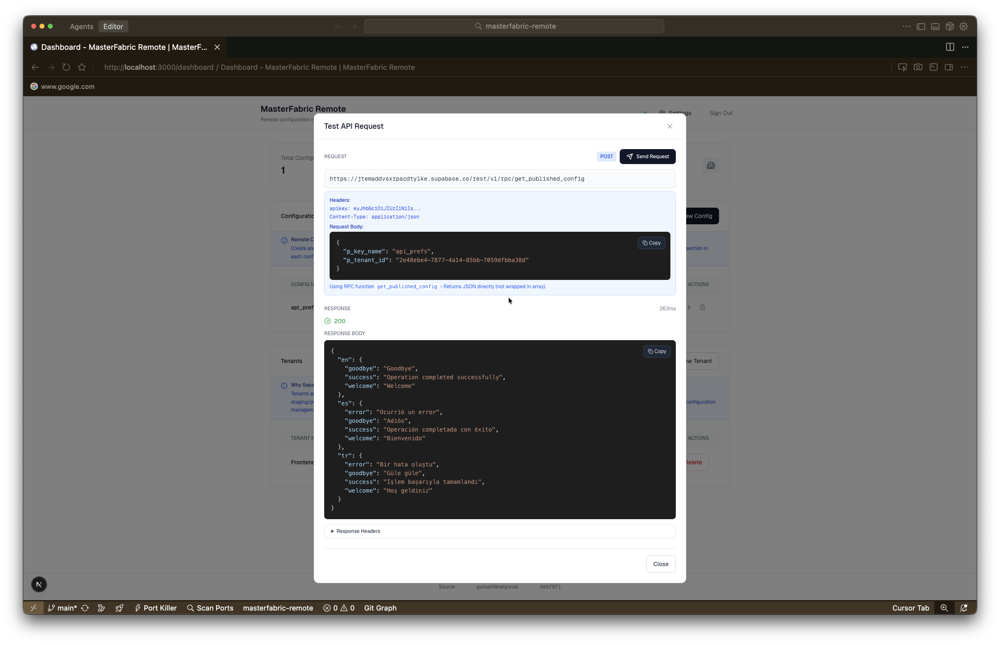

# MasterFabric Remote Config Manager

A multi-tenant remote configuration management system built with Next.js, Supabase, and TypeScript. Manage feature flags, A/B tests, and application configurations across multiple tenants with a clean, intuitive interface.

## Screenshots


*Dashboard - Overview of tenants and configurations*


*Config Editor - Side-by-side draft and published configuration management*


*Onboarding - Initial setup and Supabase connection*


*Settings - Application configuration and tenant management*


*API Integration - Code examples and endpoint testing*

## Features

- 🏢 **Multi-Tenant Support** - Manage configurations for multiple tenants/organizations with automatic API key generation
- 📝 **Draft & Publish Workflow** - Create drafts, review changes, and publish when ready with confirmation dialogs
- 🔐 **Secure API Access** - Public API endpoints with RLS (Row Level Security) policies
- 🎨 **Clean UI** - Minimalist white hierarchy design with Tailwind CSS and skeleton loading states
- ⚡ **Real-time Updates** - Built on Supabase for real-time data synchronization
- 🧪 **Test Configurations** - Test API endpoints directly from the dashboard with copyable code examples
- 📊 **Analytics** - Track request counts and usage statistics per tenant
- 🔄 **Rename Configurations** - Easily rename configuration keys with integrated rename functionality
- 📋 **Template Library** - Pre-built JSON templates for common configuration patterns
- 💻 **Multi-Language Examples** - API integration examples in multiple programming languages
- 🏥 **Health Check** - Connection status indicator in the header
- 📱 **Responsive Design** - Optimized layouts for various screen sizes

## Tech Stack

- **Framework**: Next.js 16 (React 19)
- **Database**: Supabase (PostgreSQL)
- **Styling**: Tailwind CSS 4
- **Icons**: Lucide React
- **Language**: TypeScript
- **Authentication**: Supabase Auth

## Getting Started

### Prerequisites

- Node.js 18+ and npm
- A Supabase account and project

### Installation

1. Clone the repository:
```bash
git clone <repository-url>
cd masterfabric-remote
```

2. Install dependencies:
```bash
npm install
```

3. Set up your Supabase project:
   - Create a new Supabase project at [supabase.com](https://supabase.com)
   - Copy your project URL and anon key
   - Run the SQL script from `app/onboarding/page.tsx` in your Supabase SQL Editor
     - The script creates all necessary tables, RLS policies, and initial setup

4. Run the development server:
```bash
npm run dev
```

5. Open [http://localhost:3000](http://localhost:3000) in your browser

### First-Time Setup

When you first launch the application:

1. You'll be redirected to the **Onboarding** page
2. Enter your Supabase URL and Anon Key
3. Test the connection
4. Save your credentials
5. The app will guide you through the initial setup

## Project Structure

```
masterfabric-remote/
├── app/                    # Next.js app directory
│   ├── dashboard/          # Main dashboard page
│   ├── config/[id]/       # Config editor page
│   ├── onboarding/        # Initial setup page
│   ├── settings/          # Settings page
│   └── splash/            # Splash/loading page
├── components/
│   ├── features/          # Feature components
│   ├── layout/            # Layout components
│   └── ui/                # Reusable UI components
├── lib/
│   ├── hooks/             # Custom React hooks
│   ├── supabase/          # Supabase service layer
│   └── utils/             # Utility functions
├── migrations/            # Database migrations
├── types/                 # TypeScript type definitions
└── public/                # Static assets
```

## Key Components

### ConfigTable
Displays all configurations with actions (Test, Edit, Delete). Supports filtering by tenant and status.

### EditorPanel
Side-by-side editor for managing draft and published configurations. Features:
- JSON validation
- Template library with multiple configuration types
- Save draft / Publish workflow
- Confirmation dialogs
- Rename configuration functionality
- Copyable code blocks

### ApiIntegration
Shows API endpoints and code examples in multiple languages (cURL, JavaScript, Python, etc.) for accessing published configurations. Features copy-to-clipboard functionality for easy integration.

### TenantTable
Manage tenants with automatic API key generation (with `mfr_` prefix), configuration counts, and tenant name suggestions. Supports create, edit, and delete operations.

## API Usage

### Public API Endpoint

Once a configuration is published, it's accessible via the public API:

```bash
curl -X GET "https://your-project.supabase.co/rest/v1/app_configs?key_name=eq.demoapi&tenant_id=eq.tenant-id&select=published_json" \
  -H "apikey: your-anon-key"
```

### Authentication

The public API uses Supabase's anonymous access with RLS policies. Only published configurations (`last_published_at IS NOT NULL`) are accessible via the public API.

## Database Schema

### Tenants
- `id` (UUID)
- `name` (TEXT)
- `api_key` (TEXT, UNIQUE)
- `created_at`, `updated_at` (TIMESTAMP)

### App Configs
- `id` (UUID)
- `tenant_id` (UUID, FK)
- `key_name` (TEXT)
- `draft_json` (JSONB)
- `published_json` (JSONB)
- `last_published_at` (TIMESTAMP)
- `request_count` (BIGINT)
- `created_at`, `updated_at` (TIMESTAMP)

## Recent Updates

Based on the latest commits, recent enhancements include:

- ✨ **Config Rename Functionality** - Integrated rename feature in ConfigEditorClient with EditConfigDialog
- 🎨 **Enhanced UI Components** - Improved Button component with better interaction feedback
- 📝 **Template System** - Expanded template library with new configuration types
- 🔄 **API Refactoring** - PostgREST RPC function for direct JSON fetching
- 💅 **Loading States** - Skeleton components replacing loading overlays for better UX
- 🔒 **Security** - Enhanced security headers and SEO metadata
- 📱 **Responsive Improvements** - Better layout widths and responsiveness across pages
- 🏥 **Health Monitoring** - Connection status indicator in header
- 📋 **Code Copying** - Copy-to-clipboard functionality in CodeBlock components

## Development

### Available Scripts

- `npm run dev` - Start development server
- `npm run build` - Build for production
- `npm start` - Start production server
- `npm run lint` - Run ESLint

### Code Style

- TypeScript strict mode enabled
- ESLint configuration for Next.js
- Tailwind CSS 4 for styling
- Component-based architecture
- Skeleton loading states for better UX

## Features in Detail

### Draft & Publish Workflow

1. **Create Draft**: Edit configuration JSON in the draft panel
2. **Save Draft**: Save changes without publishing
3. **Publish**: After saving a draft, publish to make it live
4. **Confirmation**: Publish dialog with options before making changes live

### Multi-Tenant Management

- Create multiple tenants (e.g., Mobile App, Web App)
- Each tenant has its own API key
- Configurations are scoped to tenants
- Track usage per tenant

### API Key Generation

- Automatic API key generation with `mfr_` prefix
- Secure random generation
- One-click generation in tenant forms

## Security

- Row Level Security (RLS) enabled on all tables
- Authenticated users can manage configurations
- Anonymous users can only read published configs via API
- API keys stored securely in database

## Contributing

1. Fork the repository
2. Create a feature branch (`git checkout -b feature/amazing-feature`)
3. Commit your changes (`git commit -m 'Add some amazing feature'`)
4. Push to the branch (`git push origin feature/amazing-feature`)
5. Open a Pull Request

## License

This project is private and proprietary.

## Support

For issues and questions, please contact the development team.

---

Built with ❤️ using Next.js and Supabase
